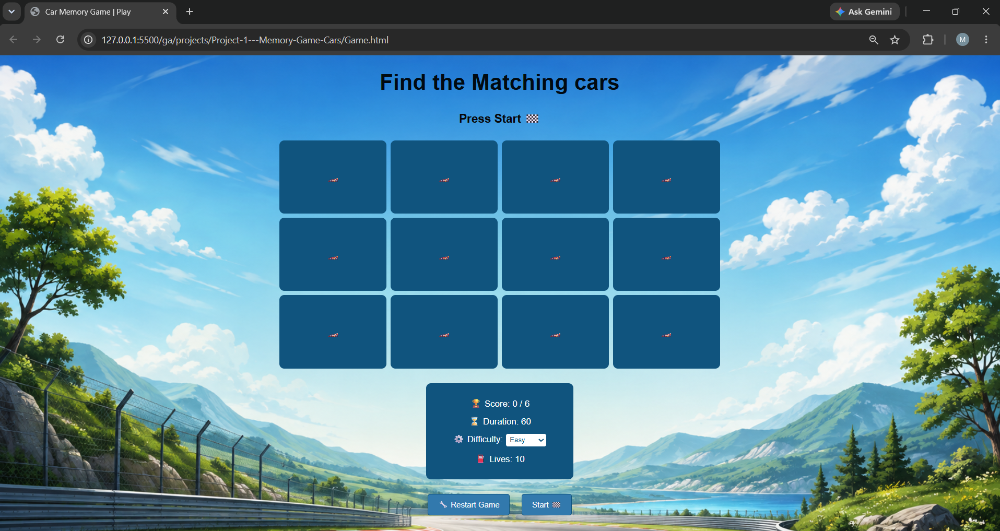
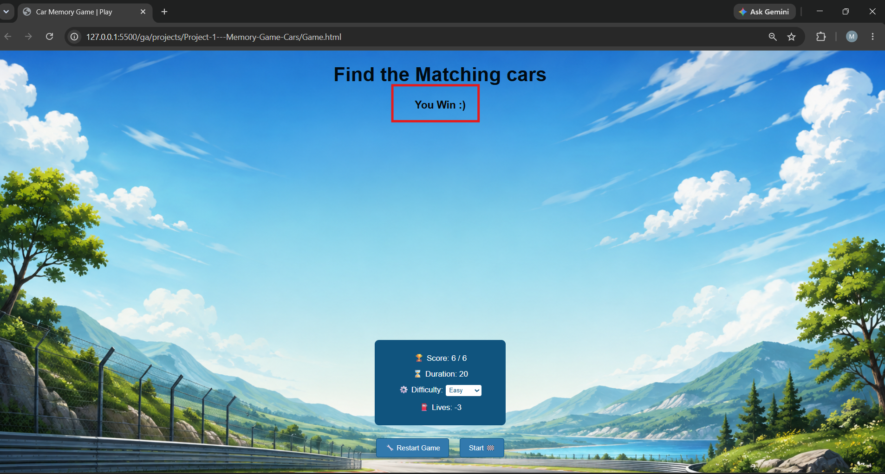

# Car Memory Game 🏎️

## Description
The player needs to find all matching pairs of cars before running out of lives or time.

## User Stories
1. As a user, I want to choose a difficulty level.
2. As a user, I want to start the game.
3. As a user, I want to click on cards to reveal cars.
4. As a user, I want to match two identical cars.
5. As a user, I want to see my score.
6. As a user, I want to have a limited number of lives.
7. As a user, I want to have a time limit for the game.
8. As a user, I want to see a winning message when I find all the pairs.
9. As a user, I want to see a game over message when I run out of lives or time.
10. As a user, I want to restart the game.

## Difficulty

- Easy: 60 seconds and 10 lives
- Medium: 45 seconds and 5 lives
- Hard: 30 seconds and 3 lives

## Technologies Used

- HTML
- CSS
- JavaScript

## Screenshot
### Strat UI

### Win UI

### Lose UI

## Future Improvements
- Add Flip effect to the cards after clicking
- Add more cars
- Add sound effects
- Add different game modes

## Credits
https://www.w3schools.com/js/default.asp

https://www.helpfulgames.com/subjects/brain-training/memory.html

https://youtu.be/PkZNo7MFNFg?si=8y0A-OtVRdhdLWvq 